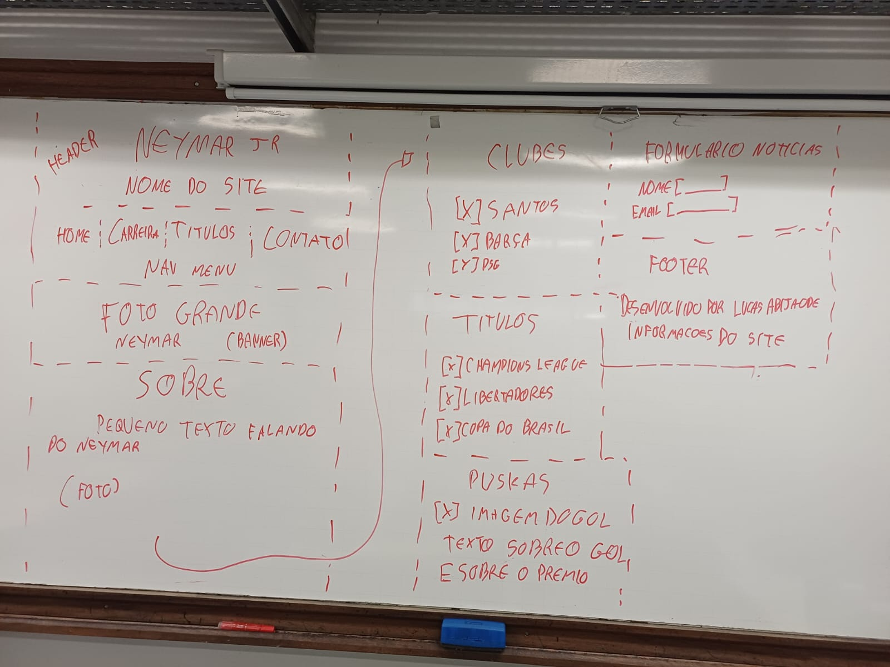

# Trabalho Prático - Semana 04

Dessa vez, vamos escolher uma proposta de projeto para trabalhar.

Nessa atividade, você deverá montar a página inicial do projeto escolhido, a organização do HTML aplicando semântica correta e uso aprimorado do CSS. Leia o enunciado completo no Canvas para mais detalhes.

**IMPORTANTE:** Você deve trabalhar e alterar apenas arquivos dentro da pasta **`public`**.

---

## Informações Gerais

- Nome: Lucas Abijaode Alvarenga
- Matrícula: 907142
- Proposta de projeto escolhida: Pessoas e Produções
- Breve descrição sobre seu projeto: O projeto é um site sobre a carreira de Neymar Jr, apresentando informações sobre sua trajetória no futebol, clubes, títulos e o prêmio Puskás.

---

## Print do(s) wireframe(s) criado

---

## Print da home-page criada

